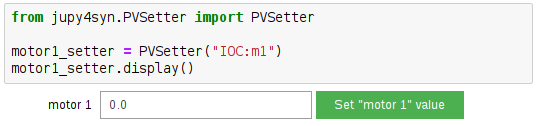

# Jupy4Syn
This repository contains the Jupy4Syn library, which provides custom Jupyter Notebook widgets to enhance user experience in the Jupyter Notebook using EPICS and Py4Syn for Synchrotron Accelerator.

## Requirements
In order to use Jupy4Syn, the following libraries must be installed:
* PyEpics
* Py4Syn
* Jupyter
* ipywidgets
* nbextensions
* Plotly

It's recommended to use the jupyter Docker image provided by SOL. This image contains everything that is necessary to use Jupy4Syn.

## How to use
 Jupy4Syn provides notebook interfaces such as:
 * PVSetter, for setting a value to a PV
 * PVMonitor, for monitoring a PV value
 * ExportLatex, for exporting the notebook to a Latex file
 * ScanGUI, for calling SOL scan-gui interface and plot it's scan result in the notebook
 * And more...

 Using these interfaces is quite simple, just create an object of the class you wish and call the display method.

Example:

```
from jupy4syn.PVSetter import PVSetter

motor1_setter = PVSetter("LNLS:motor1")
motor1_setter.display()
```



For a complete list of widgets provided by the Jupy4Syn library and its especifics behavior, go to the Docs.

## Examples

Jupyter Notebooks examples can be found in the directoy examples in this repository.
