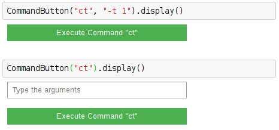

=========
CtCommand
=========

.. module:: jupy4syn.commands.CtCommand
   :synopsis: Python class for Jupy4Syn Commands CtCommand

The CtCommand is the analogue of SPEC "ct", but using the ipywidgets
interface to list all counters and their values.

The CtCommand class extends its interface methods to execute, parse initial
arguments and display.
In order to use CtCommand, one should call the :class:`jupy4syn.CommandButton`
with the command 'ct'. The CtCommand does not need extra arguments, but if extra
arguments are provided, they will be parsed by the scan-utils ct script.

If extra arguments are not provided, a textbox will be displayed, and its contents
will be parsed to the script as a string.

See the examples:

Using Jupy4Syn Commands CtCommand
=================================

Usage of Python class using basic CtCommand fields.

.. autoclass:: CtCommand
   :members:
