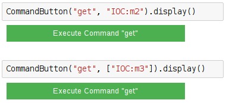

==========
GetCommand
==========

.. module:: jupy4syn.commands.GetCommand
   :synopsis: Python class for Jupy4Syn Get Command

The GetCommand is the analogue of pyepics caget, but using the ipywidgets
interface to show the PV value in a Jupyter Notebook.

The GetCommand class extends its interface methods to execute, parse initial
arguments and display.
In order to use GetCommand, one should call the :class:`jupy4syn.CommandButton`
with the command 'get'. The arguments can be a string with the PV name or
mnemonic, or it can be a list with 1 strings, the PV name or mnemonic.

See the examples:

Jupy4Syn GetCommand module
==========================

.. autoclass:: GetCommand
   :members:

