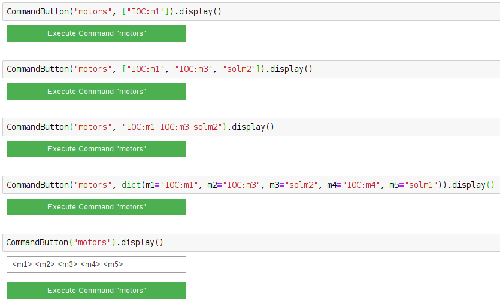

=============
MotorsCommand
=============

.. module:: jupy4syn.commands.MotorsCommand
   :synopsis: Python class for Jupy4Syn Motors Command

The MotorsCommand is used to open the Motors Interface using the ipywidgets
interface in the Jupyter Notebook environment.

The MotorsCommand class extends its interface methods to execute, parse initial
arguments and display.
In order to use MotorsCommand, one should call the :class:`jupy4syn.CommandButton`
with the command 'motors'. The arguments can be a string with the PV names or
mnemonics of the desired motors, or it can be a list of strings, with the PV names or mnemonics
of the desired motors. Algo, a dictionary can be used, but note that for using the dictionary one
must set all the "m1", "m2", "m3", "m4", "m5" keys.

Its also possible to use no arguments. In this situation, a textbox will be displayed, and its contents
will be parsed to the interface as a string.

See the examples:

Jupy4Syn MotorsCommand module
=============================

.. autoclass:: MotorsCommand
   :members:

