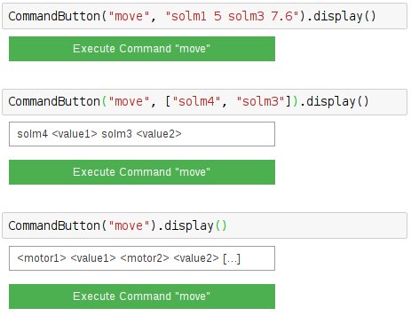

===========
MoveCommand
===========

.. module:: jupy4syn.commands.MoveCommand
   :synopsis: Python class for Jupy4Syn Commands MoveCommand

The MoveCommand is the analogue of SPEC "move", but using the ipywidgets
interface to move the motors.

The MoveCommand class extends its interface methods to execute, parse initial
arguments and display.
In order to use MoveCommand, one should call the :class:`jupy4syn.CommandButton`
with the command 'move'. The arguments can be a string with one or more 
combinations of motors mnemonics and the value to move the motors to, or it can be a list
with the mnemonics. 

Its also possible to use no arguments. In this situation and when only the name of the
mnemonics are provided, a textbox will be displayed, and its contents will be parsed
to the interface as a string.

See the examples:

Using Jupy4Syn Commands MoveCommand
===================================

Usage of Python class using basic MoveCommand fields.

.. autoclass:: MoveCommand
   :members:
