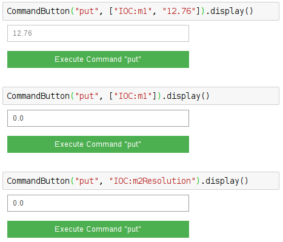

==========
PutCommand
==========

.. module:: jupy4syn.commands.PutCommand
   :synopsis: Python class for Jupy4Syn Put Command

The PutCommand is the analogue of pyepics caput, but using the ipywidgets
interface to set the PV value in a Jupyter Notebook.

The putCommand class extends its interface methods to execute, parse initial
arguments and display.
In order to use PutCommand, one should call the :class:`jupy4syn.CommandButton`
with the command 'put'. The arguments can be a string with the PV name or
mnemonic, or it can be a list with 2 strings, the PV name or mnemonic and the
value to be put when the button is clicked.

If the value to be put is provided, the text in the textbox will not be
editable.

If only the PV name or mnemonic is provided, the actual value of the PV will
be displayed in the textbox.

See the examples:

Jupy4Syn PutCommand module
==========================

.. autoclass:: PutCommand
   :members:

