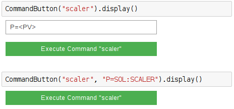

=============
ScalerCommand
=============

.. module:: jupy4syn.commands.ScalerCommand
   :synopsis: Python class for Jupy4Syn Commands ScalerCommand

The ScalerCommand is used to open the Scaler Interface using the ipywidgets
interface in the Jupyter Notebook environment.

The ScalerCommand class extends its interface methods to execute, parse initial
arguments and display.
In order to use ScalerCommand, one should call the :class:`jupy4syn.CommandButton`
with the command 'scaler'. The ScalerCommand does not need extra arguments, but it
can accept a string argument with the name of the counter PV.

If extra arguments are not provided, a textbox will be displayed, and its contents
will be parsed to the interface as a string.

See the examples:

Using Jupy4Syn Commands ScalerCommand
=====================================

Usage of Python class using basic ScalerCommand fields.

.. autoclass:: ScalerCommand
   :members:
