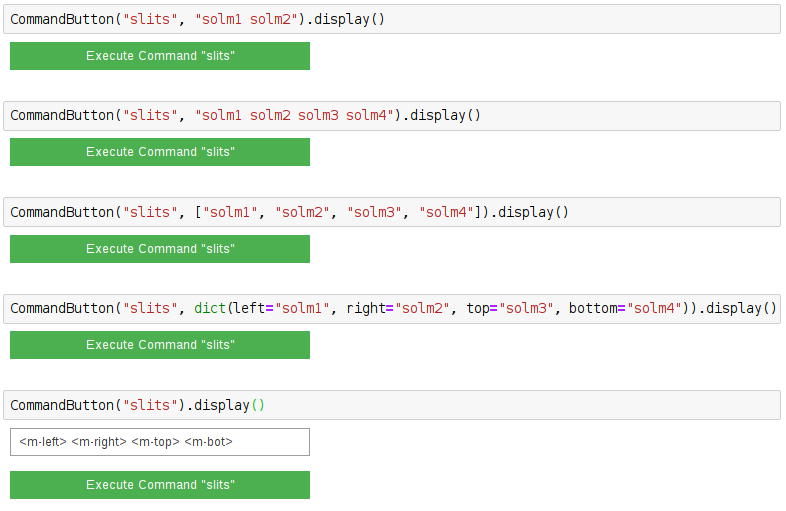

============
SlitsCommand
============

.. module:: jupy4syn.commands.SlitsCommand
   :synopsis: Python class for Jupy4Syn Commands SlitsCommand

The SlitsCommand is used to open the Slits Interface using the ipywidgets
interface in the Jupyter Notebook environment.

The SlitsCommand class extends its interface methods to execute, parse initial
arguments and display.
In order to use SlitsCommand, one should call the :class:`jupy4syn.CommandButton`
with the command 'slits'. The arguments can be a string with the PV names or
mnemonics of the desired motors, or it can be a list of strings, with the PV names or mnemonics
of the desired motors. Algo, a dictionary can be used, but note that for using the dictionary one
must set all the "left", "right", "top", "bottom".

Its also possible to use no arguments. In this situation, a textbox will be displayed, and its contents
will be parsed to the interface as a string.

.. note::
    When the arguments are a list or a string, the order of the motors in the slit interface
    is left, right, top, bottom.

See the examples:

Using Jupy4Syn Commands SlitsCommand
====================================

Usage of Python class using basic SlitsCommand fields.

.. autoclass:: SlitsCommand
   :members:
