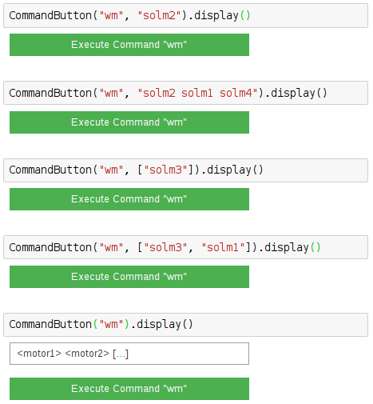

=========
WmCommand
=========

.. module:: jupy4syn.commands.WmCommand
   :synopsis: Python class for Jupy4Syn Commands WmCommand

The WmCommand is the analogue of SPEC "wm", but using the ipywidgets
interface to get the motors User and Dial positions.

The WmCommand class extends its interface methods to execute, parse initial
arguments and display.
In order to use WmCommand, one should call the :class:`jupy4syn.CommandButton`
with the command 'wm'. The arguments can be a string with one or more motors
mnemonics, or it can be a list with strings of motors mnemonics.

Its also possible to use no arguments. In this situation, a textbox will be displayed, and its contents
will be parsed to the interface as a string.

See the examples:

Using Jupy4Syn Commands WmCommand
=================================

Usage of Python class using basic WmCommand fields.

.. autoclass:: WmCommand
   :members:
