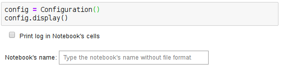

=============
Configuration
=============

.. module:: jupy4syn.Configuration
   :synopsis: Python class for Jupy4Syn Configuration

The Configuration class provides an ipywidgets interface to help setting
runtime user specific configuration. It shows:

- a checkbox for printing execution logs in the output cells
- a text box for writting the notebook's name in order to export the notebook

   Configuration example in a Jupyter notebook.

.. note::
   It's recommended to be created at the top of every notebook an instance of
   a :class:`jupy4syn.Configuration` object.

Using Jupy4Syn Configuration module
===================================

Usage of Python class using basic Configuration fields.

.. autoclass:: Configuration
   :members:
