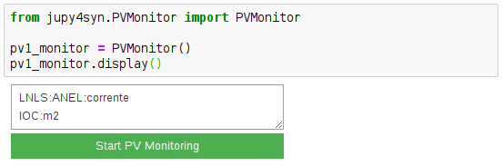
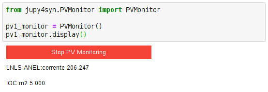

==========
PV Monitor
==========

.. module:: jupy4syn.PVMonitor
   :synopsis: Python class for Jupy4Syn PV Monitor

The PVMonitor class provides an ipywidgets interface to help monitoring PVs values
using the Jupyter Notebook. It shows:

- a text box that is used to get the PVs name to be monitored
- a button to start/stop the monitor
- the PVs values

   PVMonitor example in a Jupyter notebook.

   PVMonitor example in a Jupyter notebook.

Using Jupy4Syn PV Monitor module
=================================

Usage of Python class using basic PV Monitor fields.

.. autoclass:: PVMonitor
   :members:
