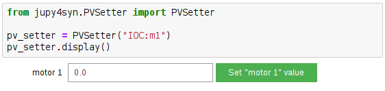

=========
PV Setter
=========

.. module:: jupy4syn.PVSetter
   :synopsis: Python class for Jupy4Syn PV Setter

.. warning::
    .. deprecated:: 0.1.2
        Please, use :class:`jupy4syn.commandButton` instead.

The PVSetter class provides an ipywidgets interface to help changing and PV value
using a Jupyter Notebook. It shows:

- a text box that is used to get the value to be set in the PV
- a button to change the PV value to the value written in the text box

   PVSetter example in a Jupyter notebook.

Using Jupy4Syn PV Setter module
=================================

Usage of Python class using basic PV Setter fields.

.. autoclass:: PVSetter
   :members:
