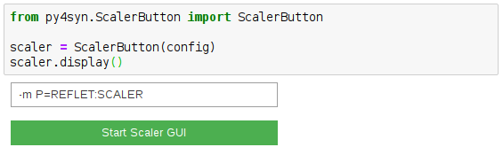
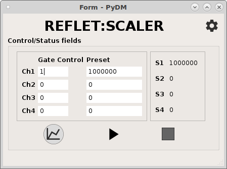

=============
Scaler Button
=============

.. module:: jupy4syn.ScalerButton
   :synopsis: Python class for Jupy4Syn Scaler Button

.. warning::
    .. deprecated:: 0.1.2
        Please, use :class:`jupy4syn.commandButton` instead.

The ScalerButton class provides an ipywidgets interface to open SOL scaler-gui interface
using the Jupyter Notebook. It shows:

- a text box that is used to get the Scaler macro
- a button to open the interface

   ScalerButton example in a Jupyter notebook.

   SOL scaler-gui interface.

Using Jupy4Syn Scaler Button module
===================================

Usage of Python class using basic Scaler Button fields.

.. autoclass:: ScalerButton
   :members:
